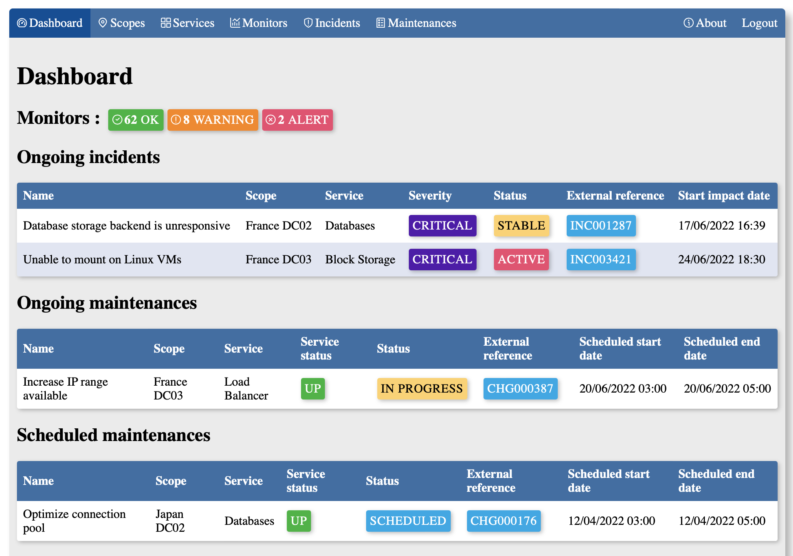
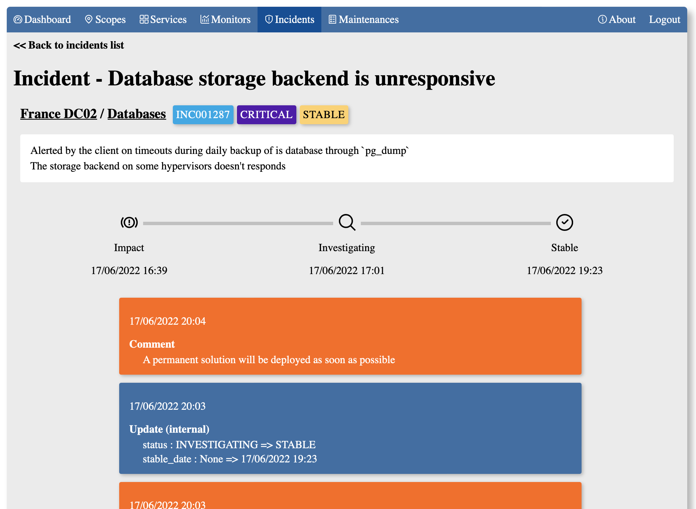

# Prod manager

Prod manager is a lightweight tool that allow you to display your production infrastructure status to your client.

## Live demo

- [Deployment with demonstration data][demo-instance]
- [Playground for you to test the app][playground-instance]

Thoses are temporary live demo, all data will be reset regulary. Servers are located in France, so if you live far from there, it may affect your experience. You can install it locally and try it out for the best demo experience (see [How to Deploy ?](#how-to-deploy)).

## Features

- Use `Scopes` to split your environment into smaller chunks
- Create `Services` to match your production environment
- Define `Monitor` to display your `Scopes`/`Services` status
  - Install custom integration to fetch and update status from external sources
    - Currently supported : [Datadog][datadog]
- Track `Incident` status and resolution
- Plan `Maintenances` when enhancing your `Service`
- Mail notifications when `CREATE` or `UPDATE` an `Incident`/`Maintenance`
- ICalendar download for `Maintenances`
- [Read only API](./docs/api/README.md)

## What's Next?

Please check [future Milestones][gitlab-milestones]

## Screenshots

[More screenshots](resources/images)

## How to Deploy ?

There are 3 deployments options : 
- [Standalone][deploy-standalone]
- [Docker Compose][deploy-compose]
- [CloudNative][deploy-kubernetes]

Advanced configurations can be found in the [application documentation][application-documentation]

## Contribute

### Bug Reports / Feature Requests

If you want to report a bug or request a new feature, feel free to open a [new issue][gitlab-new-issue].

### Merge Requests

If you want to modify Prod Manager, [thoses guidelines may be useful for you][contributing-manifest]

## Special thanks to

- [Scaleway][scaleway] where are hosted demonstration instances
- [GitLab][gitlab] for hosting the source code, images and build artefacts for this project

<!-- Links -->

[demo-instance]: https://demo.prod-manager.tiwabbit.fr
[playground-instance]: https://playground.prod-manager.tiwabbit.fr

[datadog]: https://datadoghq.com
[scaleway]: https://scaleway.com
[gitlab]: https://gitlab.com

[gitlab-milestones]: https://gitlab.com/prod-manager/prod-manager/-/milestones
[gitlab-new-issue]: https://gitlab.com/prod-manager/prod-manager/-/issues/new

[deploy-standalone]: deploy/standalone/README.md
[deploy-compose]: deploy/compose/README.md
[deploy-kubernetes]: deploy/kubernetes/README.md

[contributing-manifest]: CONTRIBUTING.md
[application-documentation]: docs/README.md